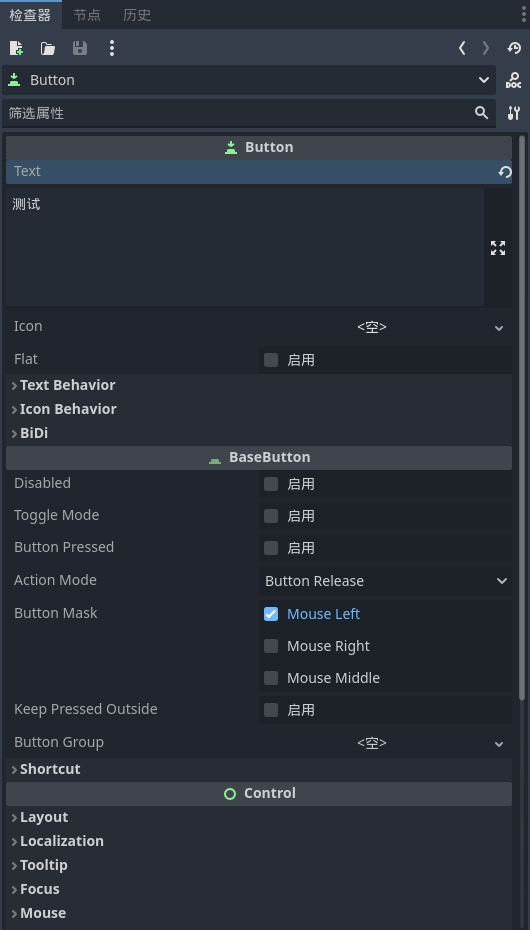

# Godot UI 系统概述

Godot 官方文档中关于 UI 部分已经写得很好了，本文档主要是结合个人实用过程中的经验，解释一些不容易理解的部分；

所以本文档并不能替代官方文档，而是对官方文档做的补充和个人经验总结，建议快速浏览一遍官方文档之后，再来看这个

[Godot UI 官方文档](https://docs.godotengine.org/zh-cn/4.x/tutorials/ui/index.html)

## 1. 类库关系 & 检查器

Godot 的 GUI 系统都继承自 Control 类，其继承关系如下：

  **Node <-- CanvasItem <-- Control**

所以，系统的 GUI 控件在 **检查器** 中至少都会显示这三个类的相关属性

如果有进一步的继承关系，就会按照 **先近后远** 的方式显示在检查器中，比如下面的是按钮 **Button** 控件的检查器

上图中，虽然只显示到 Control ,那只是因为显示不下，如果向下滚动 **检查器** 窗口，会看到如第一张图中一样的 **CanvasItem** 和 **Node** 属性模块

## 2. GUI 属于 2D 空间

GUI 在设计时，默认继承自 **CanvasItem** —— 2D 空间中所有类的抽象基类。

所以默认情况下，GUI 的可视化编辑，是在 **2D** 窗口中进行的，在 **3D** 窗口中并不显示；只在运行时，会将 **2D** 和 **3D** 元素整合显示。

但要注意，在特定情况下，GUI 控件也可以应用在 3D 空间中，比如 VR 游戏中在 3D 环境下的 UI ，GODOT 中的 GUI 系统也可以做到；大家有这个概念即可，暂时先不做详细介绍。

## 3. GUI 控件分类

根据你提供的分类方式，我将 Godot 4.2 中的所有 GUI 节点进行了如下分类：

### 3.1 容器控件（Container Controls）
容器控件用于组织和管理其他控件的排列和布局，是构建复杂 UI 界面的基础。

- **PanelContainer**：带有装饰性背景和边框的容器。
- **HBoxContainer**：水平排列子控件的容器。
- **VBoxContainer**：垂直排列子控件的容器。
- **GridContainer**：按网格排列子控件的容器。
- **CenterContainer**：将子控件居中排列的容器。
- **MarginContainer**：为子控件设置统一边距的容器。
- **ScrollContainer**：创建可滚动区域的容器，用于包含需要滚动查看的内容。
- **SplitContainer**：可调整大小的分割容器，通常用于创建左右或上下分割的面板。
- **TabContainer**：选项卡式容器，用于在多个面板之间切换。
- **BoxContainer**：包括 `HBoxContainer` 和 `VBoxContainer`，用于根据方向排列子控件的通用容器。

### 3.2 交互控件（Interactive Controls）
这些控件允许用户与界面进行交互，捕捉用户输入或触发特定行为。

#### 3.2.1 输入（Input）
- **LineEdit**：单行文本输入框，用于用户输入文字。
- **TextEdit**：多行文本输入框，适用于长文本输入。
- **SpinBox**：带有增减按钮的数字输入框。
- **ColorPicker**：颜色选择器，用于用户选择颜色。

#### 3.2.2 按钮（Buttons）
- **Button**：常规按钮，用于触发点击事件。
- **CheckBox**：复选框，允许用户选择或取消选择某项。
- **RadioButton**：单选按钮，允许用户在一组选项中选择一个。

#### 3.2.3 选择（Selection）
- **OptionButton**：下拉菜单按钮，提供多个选项供用户选择。
- **PopupMenu**：弹出菜单，通常与 `OptionButton` 结合使用。
- **ScrollBar**：滚动条，用于在内容区域中上下或左右滚动。
- **Slider**：滑块，用于调整连续数值（如音量、亮度）。

#### 3.2.4 交互窗口（Interactive Windows）
- **AcceptDialog**：带有确认按钮的对话框，用于确认操作。
- **ConfirmationDialog**：带有确认和取消按钮的对话框，用于确认或取消操作。
- **FileDialog**：文件选择对话框，允许用户选择文件或文件夹。
- **Popup**：基础弹出窗口控件，用于创建简单的临时窗口。
- **Window**：标准窗口控件，可包含其他控件，用于创建独立的对话框或窗口。

### 3.3. 展示控件（Display Controls）
展示控件用于显示文本、图像或其他内容，通常是 UI 界面中的核心组成部分。

#### 3.3.1 基础图、文展示（Basic Image and Text Display）
- **Label**：用于显示静态文本。
- **RichTextLabel**：支持富文本格式的文本显示，包含多种样式和格式。
- **TextureRect**：用于显示纹理（图片）。
- **NinePatchRect**：显示九宫格纹理，可用于拉伸按钮和背景。
- **ProgressBar**：用于显示任务进度的控件。

#### 3.3.2 格式化数据展示（Formatted Data Display）
- **ItemList**：显示列表项的控件，适合选择或浏览项目列表。
- **Tree**：用于展示树状结构数据的控件，适合展示层次结构的数据。
- **GraphEdit**：用于创建可视化图表编辑器的控件。
- **GraphNode**：图表编辑器中的节点控件，通常与 `GraphEdit` 一起使用。

#### 3.3.3 视频、音频展示（Video and Audio Display）
- **VideoPlayer**：用于播放视频的控件。
- **Range**：表示可调整范围的控件，`Slider` 和 `ProgressBar` 都继承自它。

### 3.4 高级及特殊控件（Advanced and Special Controls）
这些控件提供了更高级的功能或用于特定的应用场景，适合在更复杂的 UI 和交互设计中使用。

- **AnimationPlayer**：用于播放和控制动画的控件。
- **Sprite**：显示精灵图像的控件，通常用于2D游戏或界面中的动态图像。
- **Panel**：基础的面板控件，用于绘制背景和边框，通常不用于布局。
- **TabBar**：用于创建选项卡栏，通常与 `TabContainer` 一起使用。
- **Range**：用于表示一个范围的控件（如滑块），通常与 `ProgressBar` 和 `Slider` 一起使用。
